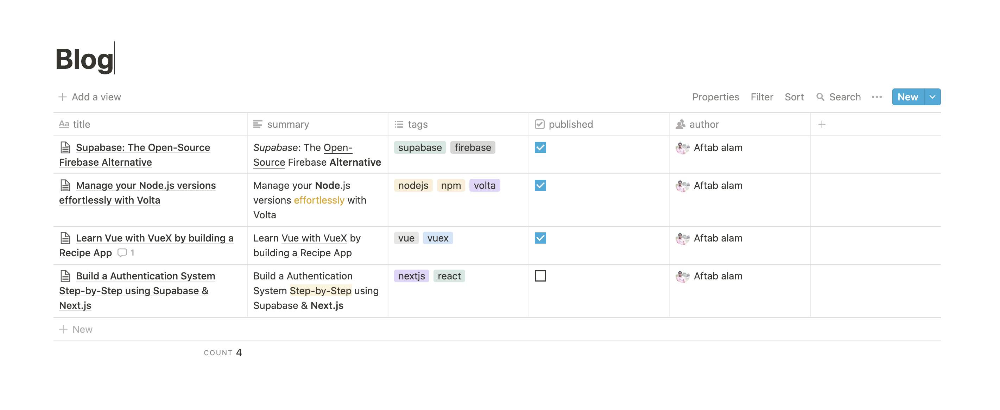

# Svelte Notion Kit

Boilerplate to quckly get up and running with Svelte and Notion, with

- __Typescript__ as the language choice
- __Tailwind CSS__ for quick styling without getting out of your HTML
- __ESLint__ for static code analysis
- __Prettier__ for code formatting
- __SEO__ pre-configured
- __Icons__ support out of the box

## How to configure Notion?
- Retrieve a `NOTION_TOKEN` by following their [Getting Started guide](https://developers.notion.com/docs/getting-started)
- Create a table as the database of your content, and copy its `id`. Maintain it as `NOTION_DATABASE_ID`
- Add following columns as a post attribute
    - `title` (title) - For post title
    - `summary` (text) - For post summary
    - `tags` (multi-select) - For post tags
    - `author` (person) - For post's Author
    - `published` (checkbox) - Published? (un-used currently)

This will setup your Notion table, as the table for your SvelteKit + Notion blog. Congrats!

## How to configure the SvelteKit App?
- The `NOTION_TOKEN` and `NOTION_DATABASE_ID` is expected to be available in your Vercel/Netlify account as environment variables. Add them, fork the project and deploy on Vercel.
- The project uses the [@sveltejs/adapter-vercel](https://github.com/sveltejs/kit/tree/master/packages/adapter-vercel) by default. If you want to deploy on Netlify, install [@sveltejs/adapter-netlify](https://github.com/sveltejs/kit/tree/master/packages/adapter-netlify) and change the `adpater` key in `svelte.config.js` to `netlify()
- __Your local instance expects `VITE_` prefixed with the aforementioned environment variables to run.__ Refer `.env.example` for help.
